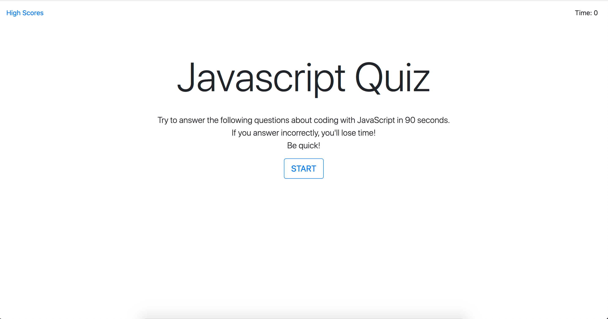
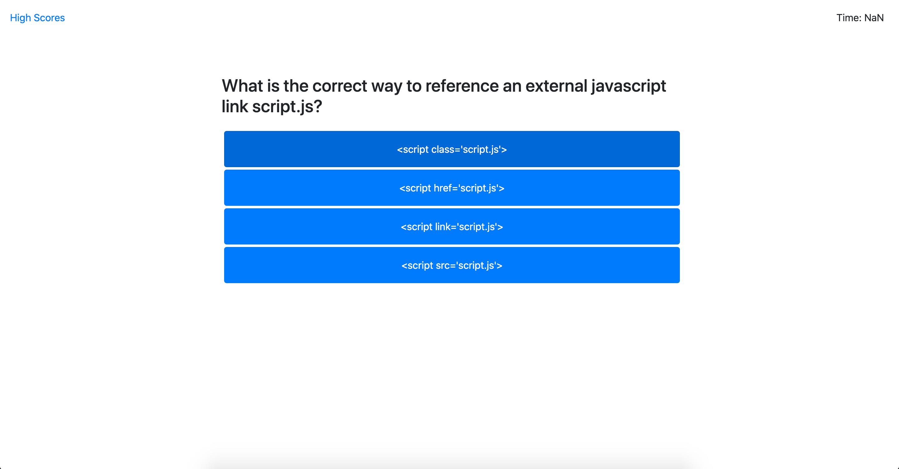
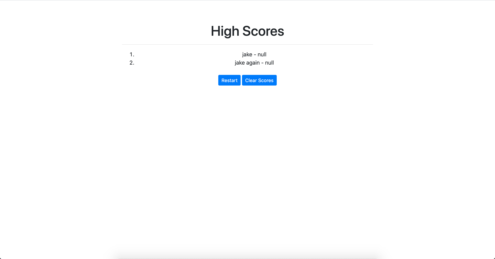

## Code quiz ##

;

This assignment was not only to test my skills with javascript but to create a test for others to take and log their scores. 

There are some multiple choice questions to answer. If answered correctly move on to the next question. If answered incorrectly lose time and then move on to the next question.

Once finished log your time remaining as your score with your name and are prompted if you would like to start the quiz again.

;

;

I had some troubles with this exercise. At first I took the wrong approach and needed to start over as within the first few selections to start the quiz and answer the questions my .js file was already around 80+ lines.

I begun again about 4 times throughout this assignment as my approach was not working any way. I finally settled on using multiple .js and .html pages to make my primary .js more concise and legible. 

I still have some bugs due to my needing to start over multiple times but for the most part I have managed a somewhat working application. 

The bugs are my timer only shows a value of NaN and I cannot figure out where I've gone wrong.
And the final question ends with an error and doesn't recognise the answer and I'm unsure as to why that is.

Both of these have led me to rewrite my code a few times and try to break it apart to find the issue but with no luck.

I feel strongly as if I'm falling behind with this section possibly due to the pace and that I also work full time outside of these studies. 

I sourced my understanding of this code through many different avenues;
-mozilla MDN web docs
-class activities and recorded lessons
-countless stack overflow forums
-w3 schools
-freecodecamp
-codepen